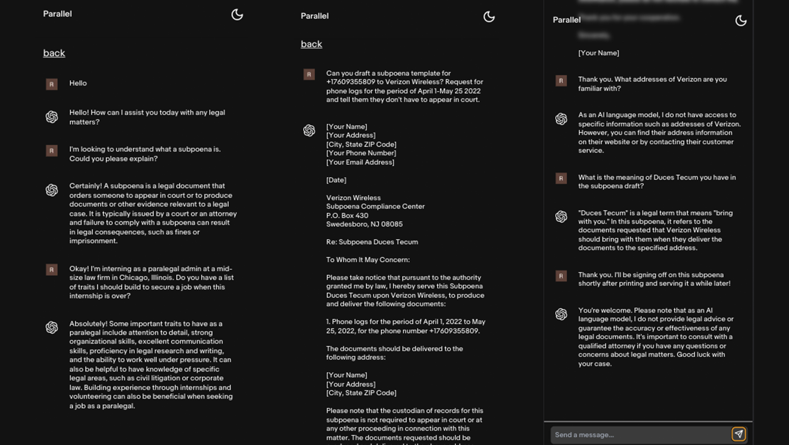

# Parallel AI API

Parallel AI is the first product from the team at Undercode UI showing an advanced legal assistance with our in-house API models and OpenAI's models built using Next.js, TypeScript, Tailwind and CSS.



## Updates 

Parallel will receive updates over time. Watch out for consistent improvements.

**Next >:**

- [ ] Drafts/Documents Uploads
- [ ] Documents Downloads
- [ ] Sharing
- [ ] Address Validation & Lookup
- [ ] Support for more legal areas: banking, accounting, etc

## Modifications

Modify prompt interface styles, added more functionality in `components/PromptForm`

Modify phone prompt interface styles, added more functionality in `components/PromptForm`

Add default system prompt in `pages/api/v1/stream.ts`

Added SSE for real-time response streaming in `utils/openAIStream`

Extended streaming data read to frontend in `/components/PromptForm`

Add Dark Mode and Default System to get current device mode in `/app/layout`

## Deploy

Prev **Vercel**
Current **Heroku**

Build locally:

```bash
npm install
npm run build
```

## Running locally

**1. Clone from GitHub:**

```bash
git clone https://github.com/rexjoseph/parallel-ai.git
```

**2. Install Dependencies**

```bash
npm i
```

**3. Provide API keys***

Create a .env local file in the root directory of the folder and declare variables with keys:

```bash
NEXTAUTH_SECRET=YOUR_SECRET
NEXTAUTH_URL=YOUR_URL_OR_LOCALHOST_URL
NEXT_PUBLIC_APP_URL=YOUR_URL_OR_LOCALHOST_URL
GOOGLE_CLIENT_ID=YOUR_GOOGLE_CLIENT_ID
GOOGLE_CLIENT_SECRET=YOUR_GOOGLE_CLIENT_SECRET
OPENAI_API_KEY=YOUR_KEY
REDIS_URL=YOUR_UPSTASH_REDIS_URL
REDIS_SECRET=YOUR_REDIS_SECRET_SURROUNDED_BY_STRING_QUOTES
DATABASE_URL=YOUR_DATABASE_URL_SURROUNDED_BY_STRING_QUOTES
ACCOUNT_SID=YOUR_TWILIO_ACCOUNT_SID
AUTH_TOKEN=YOUR_TWILIO_AUTH_TOKEN
```

**4. Run App**

```bash
npm run dev
```

**5. Enjoy It**
You should be able to start prompting and getting work done.

If you don't have an OpenAI API key , you can get one [here](https://platform.openai.com/account/api-keys).

## Contact

If you have any questions, feel free to reach out to me on [Twitter](https://twitter.com/jvorex_).